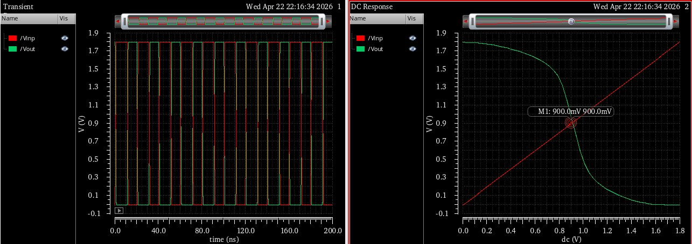
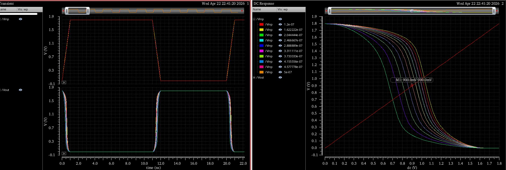
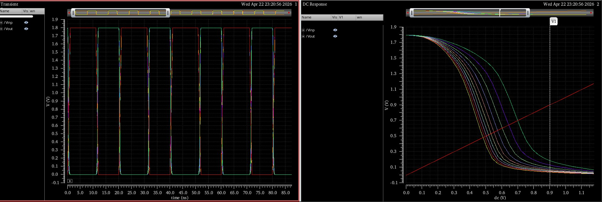
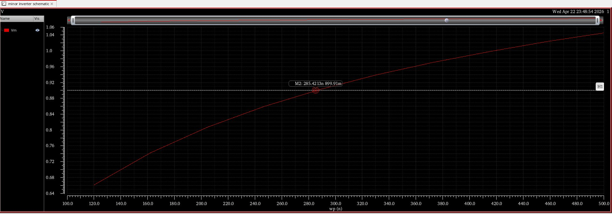
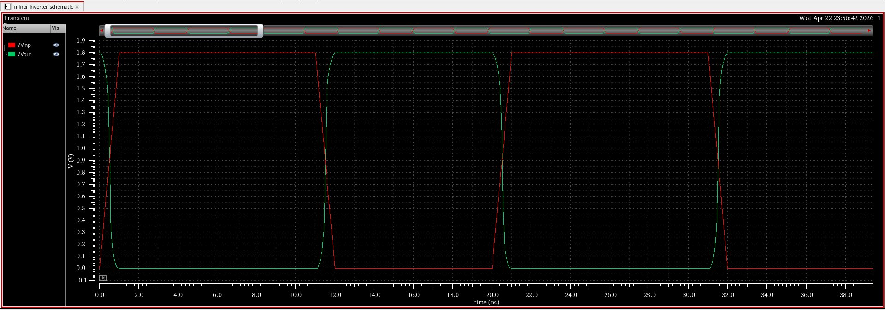
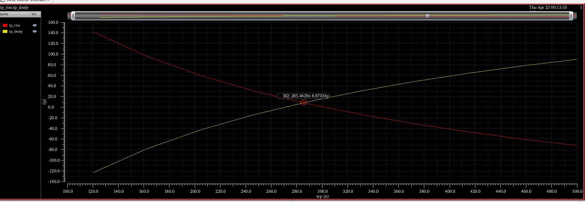
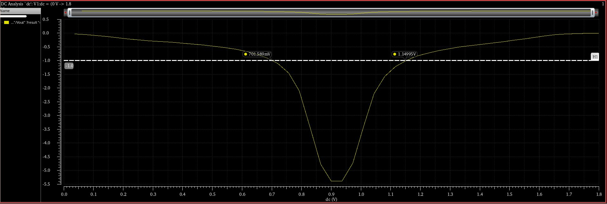

# CMOS Inverter — Telescopic Design Methodology
### From Physical Intuition to Verified Silicon Behaviour


---

## Design Philosophy

This project is built on a single conviction:

> **A circuit designer who cannot predict a simulation result before running it does not yet understand the circuit.**

Every step in this project follows a strict discipline:
1. State the physical question
2. Build the causal chain from first principles
3. Predict the result
4. Run the simulation
5. If prediction fails — understand *why* before moving forward

This is not a simulation exercise. It is a physical reasoning exercise that happens to use a simulator for verification.

The methodology is **telescopic** — meaning each stage of understanding is built directly on top of the previous one, with no unexplained jumps. The inverter studied here is not just a logic gate. It is the conceptual seed from which the bistable latch, the 6T SRAM cell, and eventually the sense amplifier all grow.

---

## Why The Inverter First?

The CMOS inverter contains the essential physics of every more complex analog and mixed-signal circuit:

```
Inverter switching threshold (VM)
        ↓ cross-couple two inverters
Bistable latch — two stable states — memory element
        ↓ add access transistors
6T SRAM cell — controllable read and write
        ↓ add regenerative amplification
Sense amplifier — rail-to-rail output from mV differential
```

If you do not understand *why* the inverter switches where it does — you cannot understand read disturb in SRAM, you cannot understand regeneration in a sense amplifier, and you cannot size any of these circuits with confidence.

This is why the inverter is Stage 1.

---

## Technology

| Parameter | Value |
|-----------|-------|
| Technology | gpdk090 (90nm CMOS) |
| Tool | Cadence Virtuoso + Spectre |
| VDD | 1.8V |
| Minimum L | 100nm |
| Minimum W | 120nm |
| µn/µp ratio | **2.38** (not assumed — extracted experimentally) |

---

## The Telescopic Design Flow

Each step below begins with a prediction, encounters a result, and either confirms or reveals a new physical insight. The failures are as important as the successes.

---

### Step 1 — Symmetric Sizing: The Honest Starting Point

**The question:**
> If I know nothing about this technology's mobility ratio,
> what is the most defensible starting point?

**The reasoning:**

Minimum symmetric sizing — Wn = Wp = 120n, L = 100n — imposes no prior assumptions. It is the most intellectually honest baseline: equal width means equal geometry. Whatever asymmetry exists in the physics of the technology will reveal itself in the simulation.

**Prediction before simulation:**

```
µn > µp universally in CMOS
→ kn = µn × Cox × (W/L) > kp at equal sizing
→ NMOS pull-down intrinsically stronger
→ VM expected to shift LEFT of VDD/2
→ i.e. VM < 900mV
```

**Simulation result:**


*Marker M1 confirms: VM = 900mV = VDD/2 exactly*

**Why the prediction was wrong — and what that reveals:**

The prediction assumed that mobility difference dominates at minimum sizing. In gpdk090 at 90nm, short-channel effects, threshold voltage tuning, and process calibration partially compensate for the mobility imbalance at minimum dimensions. The result is an accidentally symmetric VTC.

This is not a failure — it is a critical data point. It tells us:
- gpdk090 at minimum sizing is self-compensating
- The mobility asymmetry will only manifest as sizing deviates from minimum
- Our baseline VM = VDD/2 is confirmed at Wn = Wp = 120n

---

### Step 2 — PMOS Width Sweep: What Controls VM?

**The question:**
> Now that we have a baseline, how sensitive is VM to transistor sizing?
> And in which direction?

**The reasoning:**

PMOS is chosen as the first sweep variable because it is conventionally the weaker device. The prediction follows the resistor-divider model of the inverter:

```
Wp↑ → more parallel conduction channels
     → kp↑ (intrinsic transconductance increases)
     → Id↑ for same VSG (more current capability)
     → Ron,p = 1/kp(VSG - |Vtp|) DECREASES
        ← this is the CONSEQUENCE, not the cause
     → Vout = VDD × Ron,p/(Ron,p + Ron,n)
        Ron,p decreases → Vout INCREASES for same Vin
     → VTC body shifts upward and leftward
     → VM DECREASES
```

**Critical clarification on causality — the most common mistake:**

Most students say: *"Ron decreases therefore current increases."*
This inverts the causal chain. The correct sequence is:

```
Wp↑  →  kp↑  →  Id↑  →  Ron,p↓
CAUSE    CAUSE    EFFECT   EFFECT
```

Width increase IS the physical change. Ron is simply how we measure the consequence of that change. Confusing effect for cause leads to incorrect predictions when sizing changes in unusual ways.

**Simulation result:**


*VTC curves translate leftward monotonically. Prediction confirmed.*

**What the non-linearity reveals:**

The VM shift is not proportional to Wp. It follows a square-root compression because VM depends on √(kn/kp). Doubling Wp does not halve VM — it moves it by a diminishing amount. This non-linearity is analytically expected and experimentally confirmed.

---

### Step 3 — NMOS Width Sweep: Validating the Model

**The question:**
> Does NMOS width produce the same VM direction as PMOS?
> Or opposite?

**The reasoning:**

```
Wn↑ → kn↑ → Id↑ → Ron,n↓
     → Vout = VDD × Ron,n/(Ron,p + Ron,n)
        Ron,n decreases → Vout DECREASES for same Vin
        (opposite direction to PMOS case)
     → VTC body shifts downward and leftward
     → VM DECREASES
```

Both sweeps predict VM shifting left — but through opposite Vout mechanisms. This is the tug-of-war model: VM is determined purely by the *ratio* of transistor strengths, not by the absolute size of either alone.

**Simulation result:**


*VTC shifts left with increasing Wn. Prediction confirmed.*

**Synthesis — what both sweeps together reveal:**

| Parameter | PMOS W↑ | NMOS W↑ |
|-----------|---------|---------|
| Network strengthened | Pull-UP | Pull-DOWN |
| Vout for same Vin | Increases | Decreases |
| VTC body movement | Upward + left | Downward + left |
| VM direction | Decreases | Decreases |
| Physical mechanism | PMOS wins tug of war | NMOS wins tug of war |

VM is not a property of either transistor in isolation. It is a property of their *competition*.

---

### Step 4 — Exact Wp Extraction: Finding VM = VDD/2

**The question:**
> What exact PMOS width centres VM at VDD/2?
> And what technology parameter does this reveal?

**The reasoning:**

VM = VDD/2 is the target because it maximises and equalises both noise margins simultaneously. From the PMOS sweep data, a cross-function parametric extraction identifies the exact crossing point.

**Prediction:**

```
For VM = VDD/2 → kn = kp (from derivation in vm_derivation.md)
→ Wp/Wn = µn/µp
→ The exact ratio will reveal the true µn/µp of gpdk090
```

**Simulation result:**


*Marker M2: Wp = 285.42n → VM = 899.91mV ≈ 900mV*

**Technology parameter extracted:**

$$\frac{W_p}{W_n} = \frac{285.42\text{n}}{120\text{n}} = \mathbf{2.38}$$

$$\boxed{\frac{\mu_n}{\mu_p} = 2.38 \text{ in gpdk090}}$$

This is not taken from a datasheet. It is measured directly from the inverter's switching behaviour — extracted from the physics of the device, not assumed from literature.

---

### Step 5 — Baseline Transient: The Asymmetry Appears

**The question:**
> We have centred VM. Does the dynamic behaviour also balance at this sizing?

**The observation:**


*Output fall (NMOS discharge) is visibly faster than output rise (PMOS charge). tpLH > tpHL.*

**Why this is not surprising:**

VM centering is a DC condition — it balances the static operating point. But propagation delay is a dynamic condition — it depends on how quickly each transistor can charge or discharge the load capacitance CL. These are related but not identical constraints. At Wp = 285.42n, the DC balance is achieved but the dynamic balance may require a different sizing. This is the next question to answer.

---

### Step 6 — Delay Balancing: The Convergence

**The question:**
> What sizing balances tpHL and tpLH?
> Is it the same as VM = VDD/2 or different?

**Prediction before simulation:**

```
tpHL ∝ CL / kn   (NMOS discharges output node)
tpLH ∝ CL / kp   (PMOS charges output node)

For tpHL = tpLH:
CL/kn = CL/kp
→ kn = kp

This is IDENTICAL to the VM = VDD/2 condition.
Prediction: both optimisations converge at the same Wp.
```

**Simulation result:**


*Crossover at Marker M2: Wp = 285.4629n, tp = 8.87034ps*

**Comparison:**

| Optimisation | Wp Required | Governing Condition |
|-------------|-------------|-------------------|
| VM = VDD/2 | 285.42n | kn = kp |
| tpHL = tpLH | 285.46n | kn = kp |
| **Difference** | **0.04n ≈ 0** | **Same condition** |

**The core insight:**

> VM centering and delay balancing are not two separate optimisations. They are two different observable consequences of the same underlying physical condition: kn = kp.
>
> This means the question *"should I optimise for VM or for delay?"* is a false dichotomy in this technology. The answer is both — at the same sizing.
>
> **One sizing. Two benefits. One root cause.**

This is what the telescopic approach reveals that pure simulation would not: the *reason* why two apparently different metrics converge.

---

### Step 7 — Noise Margin Extraction: Quantifying Immunity

**The question:**
> Having found the optimal sizing, what is the actual noise immunity of this inverter?

**Method:** Voltage gain plot (dVout/dVin vs Vin) — unity-gain crossings define VIL and VIH.

**Simulation result:**


*Peak gain ≈ 5.4 at VM confirms high gain in transition region*

**Extracted values:**

| Parameter | Expression | Value |
|-----------|-----------|-------|
| NML | VIL − VOL | **701.589mV** |
| NMH | VOH − VIH | **650.05mV** |
| Symmetry | NMH / NML | **0.926 ≈ 1** |
| Peak gain | \|dVout/dVin\|max | **≈ 5.4** |

Near-symmetric noise margins confirm the sizing is correct. The small residual asymmetry (701mV vs 650mV) is attributable to threshold voltage mismatch between PMOS and NMOS — a second-order effect that cannot be corrected by width alone.

---

## Complete Results Summary

| Step | What Was Done | Key Finding | Physical Reason |
|------|--------------|-------------|----------------|
| 1 | Symmetric sizing Wn=Wp=120n | VM = 900mV = VDD/2 | gpdk090 self-compensating at minimum size |
| 2 | PMOS sweep 120n→500n | VM shifts LEFT | kp↑ → Ron,p↓ → Vout↑ → VM↓ |
| 3 | NMOS sweep | VM shifts LEFT | kn↑ → Ron,n↓ → Vout↓ → VM↓ |
| 4 | Wp cross-function extraction | Wp = 285.42n, µn/µp = 2.38 | kn = kp required for VM = VDD/2 |
| 5 | Baseline transient at Wp=285.42n | tpLH > tpHL asymmetry | DC balance ≠ dynamic balance |
| 6 | Delay crossover sweep | Crossover at Wp = 285.46n | kn = kp governs both metrics |
| 7 | Noise margin extraction | NML=701mV, NMH=650mV | Symmetric sizing → symmetric immunity |

---

## Full Analytical Derivation

The complete mathematical derivation of VM from
first principles — including the sizing evolution
reasoning in detail:

[→ View vm_derivation.md](vm_derivation.md)

---

## Part of Larger Telescopic Project

| Stage | Topic | Key Concept Inherited From Inverter | Status |
|-------|-------|-------------------------------------|--------|
| **1 — Inverter** | **VM, Delay, Noise Margins** | **Foundation** | **✅ This repo** |
| 2 — Bistable Latch | Cross-coupled feedback | VM becomes metastability point | 🔲 |
| 3 — 6T SRAM Cell | Write/Read/Hold SNM | VM becomes read disturb threshold | 🔲 |
| 4 — Sense Amplifier | Comparative SA analysis | VM becomes regeneration trigger | 🔲 |

The inverter's switching threshold is not an isolated concept.
It is the same physics — tug of war between pull-up and pull-down —
that determines stability in every subsequent stage.

---

## References

- Razavi, B. — *Design of Analog CMOS Integrated Circuits*, 2nd Ed.
- Weste, N. & Harris, D. — *CMOS VLSI Design*, 4th Ed.
- gpdk090 Process Design Kit Documentation

---

*NIT Uttarakhand | B.Tech ECE | Analog IC Design | April 2026*
