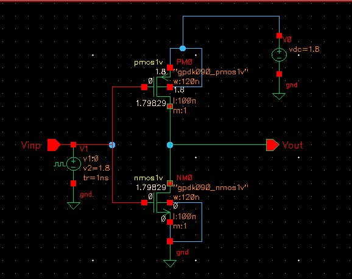

# The Inverter That Argued Back — CMOS Characterisation in gpdk090

**A single-circuit engineering notebook: the CMOS inverter, characterised from nothing to fully understood.**


> A circuit designer who cannot predict a simulation result before running it does not yet understand the circuit.

This is not a folder of simulation screenshots. It is the record of an argument — between what I thought a CMOS inverter would do, and what it actually did — spread across seven chapters, until the two finally agreed for the right reasons.

---

## Prologue: Why an Inverter Deserves a Whole Story

An inverter is two transistors and a wire. It's usually the first thing anyone draws in a CMOS course, and the temptation is to treat it that way — sketch it, simulate it once, move on. I didn't, and the reason is simple: **"the simulation gave the right number" and "I understand the circuit" are not the same claim, and it's very easy to mistake one for the other.**

The test I set for myself was this: could I write down what a simulation would show *before* running it, and be right for the right reasons — not just right? An inverter is small enough that this discipline can actually be checked. Two transistors, one output node, no place for a wrong assumption to hide behind extra complexity. If a prediction failed, there were only a few places the failure could have come from, which meant I could actually trace it back and fix the *reasoning*, not just the answer.

That's why this notebook exists as seven chapters instead of one plot. Each chapter is a question I asked about this one circuit, a prediction I committed to in writing before touching the simulator, and — more often than I expected — a contradiction between the two that forced me to fix something in how I was thinking, not just in a number.

**Objectives set at the start**, which double as the table of contents for this argument:
1. Start from a technology I know nothing about, with no borrowed assumptions.
2. Understand — causally — how each transistor's width moves VM.
3. Find the exact sizing that centres VM at VDD/2, and use it to extract the technology's real µn/µp.
4. Find out whether that same sizing also balances propagation delay.
5. Quantify noise immunity at the final sizing.
6. Don't call the circuit "understood" until every one of the above is predictable *before* the simulation runs.

**The technology**, so the numbers below have a home:

| Parameter | Value |
|-----------|-------|
| Process | gpdk090 (90 nm CMOS, generic PDK) |
| Tool / Simulator | Cadence Virtuoso / Spectre |
| VDD | 1.8 V |
| Minimum L | 100 nm |
| Minimum W | 120 nm |
| Devices | `nmos1v`, `pmos1v` |
| Input stimulus | Pulse 0→1.8 V, tr = 1 ns (transient); DC sweep 0→1.8 V (VTC) |

One number is deliberately absent from that table: µn/µp. Textbooks quote 2–3 and leave it there. I wanted the number this specific PDK actually uses, measured from its own switching behaviour, not copied from a book. That measurement becomes Chapter 4's real payoff.

Every chapter below follows the same loop, because the loop *is* the discipline the project was built to practise:

```
Question → Mental model → Prediction (written down first) → Sanity check →
Simulation → Contradiction (if any) → Missing physics → Updated model → Next question
```

The contradictions are kept in, on purpose. They're where the story actually happens — and, chapter to chapter, each contradiction is *why* the next question got asked. Nothing here moves forward just because it's "next on the list"; each new experiment exists because the previous one left something unexplained.

---

## Chapter 1 — The Baseline That Refused to Behave

The story opens with a bias I didn't know I was carrying. Every CMOS process I'd read about has µn > µp — electrons simply move faster than holes. So before running anything, I made a prediction: with Wn = Wp = 120 nm and L = 100 nm (equal, minimum geometry, no sizing assumption), the stronger NMOS should win the tug-of-war, and VM should sit *below* VDD/2 — somewhere left of 900 mV.



*Fig 1 — the schematic — is the plainest picture in the whole notebook: PM0 and NM0, both 120n/100n, VDD tied to 1.8 V. Nothing clever. That was the point — equal minimum geometry means whatever asymmetry shows up later is the technology talking, not me.*

Before trusting a DC sweep, I ran a transient pulse to make sure the testbench itself wasn't lying to me — rail-to-rail, complementary switching, clean edges.


*Fig 2 — Transient (left): clean 0 ↔ 1.8 V switching, no half-measures. VTC (right): marker M1 reads 900.0 mV → 900.0 mV.* Only once the transient was clean did the VTC get to speak. And it said something I didn't expect:

**VM = 900.0 mV. Exactly VDD/2.** My prediction was wrong.

Here's where the story gets its first twist. I'd assumed mobility imbalance would dominate at minimum size. It doesn't, not alone — at 90 nm, short-channel effects and the PDK's own threshold-voltage calibration quietly compensate for the mobility gap right at minimum geometry. Equal minimum sizing in gpdk090 turns out to be *accidentally* symmetric. Not a law of physics — a coincidence of this particular node, at this particular size.

That's an unsettling thing to learn on page one, because it means the asymmetry I expected is still out there, just hiding — I just haven't moved the sizing far enough from minimum to see it yet. **Why go to Chapter 2 next:** the only way to test "is the mobility gap hiding, or was I simply wrong about it existing" is to stop holding size fixed and deliberately unbalance one device at a time.

*What Chapter 1 leaves behind: a 900 mV reference point that every later chapter measures itself against, and a working model — VM as the equilibrium point of a tug-of-war between pull-up and pull-down strength — that's about to be tested twice.*

---

## Chapter 2 — Widening the PMOS, and Getting the Right Answer for the Wrong Reason

If VM is a tug-of-war, the obvious next experiment is to make one side stronger and watch which way the rope moves. I held Wn fixed at 120 nm and swept Wp from 120 nm to 500 nm across ten steps — one variable at a time, nothing else touched.

**Prediction, from the divider intuition** Vout ≈ VDD·Ron,n/(Ron,p+Ron,n): a wider PMOS means a stronger pull-up, so Vout should lift at every input, and the crossing point — VM — should slide *left*.


*Fig 3 — VTC family for Wp = 120n → 500n, Wn fixed.* Exactly what the prediction called for: the whole VTC family shifts up and left as Wp grows, monotonically, and the crossing with the Vin = Vout diagonal walks steadily leftward with it.

Direction: correct. But when I tried to say out loud *why*, the sentence that came out was "Ron of the PMOS decreases, so its current increases" — and that sentence has the causality backwards. The simulation can't catch that mistake, because the numbers agree with it either way. This was the first real contradiction of the project, and it wasn't in the plot — it was in my own explanation.

**The correct chain, width as the actual cause:**

```
Wp↑  →  more parallel conduction channels
     →  kp↑              (intrinsic transconductance parameter)
     →  Id↑ at same VSG  (more current capability)
     →  Ron,p↓           ← CONSEQUENCE, not cause
     →  Vout↑ for the same Vin
     →  VTC shifts up and left
     →  VM↓
```

Width is upstream of everything. Ron is just the shorthand we use to summarise the effect afterward — the way adding a resistor in parallel drops total resistance *because* a path was added, not the other way round. It sounds like a technicality until a sizing change behaves unexpectedly and the backwards chain predicts the wrong direction with total confidence.

One more thing Fig 3 was quietly telling me: the VM shift per step *shrinks* as Wp grows. Not a rendering artifact — VM depends on √(kn/kp), a square root, so doubling Wp does not double the effect. That compression comes back with real consequences in Chapter 4.

*What Chapter 2 leaves behind: the rule W → k → Id → Ron, in that strict order, plus a warning that a correct number can be hiding an inverted model. The pull-up side of the tug-of-war is now understood. **Why go to Chapter 3 next:** a tug-of-war has two sides, and I'd only tested one — strengthening the PMOS says nothing about whether strengthening the NMOS behaves as a true mirror image or breaks the symmetry in some new way. That has to be checked, not assumed.*

---

## Chapter 3 — Widening the NMOS, and Being Half Right in the Worst Way

Same experiment, mirrored: hold Wp fixed, sweep Wn. I wrote the prediction down before running anything, verbatim, because it's the one worth keeping as evidence: *Wn↑ → Id↑, and since Vgs is fixed, Vds must increase, so Vout rises and the curve shifts up-left.* I predicted VM moving left with Vout climbing.


*Fig 4 — VTC family for increasing Wn.* It agreed with half of that sentence. The curves do shift left, same as the PMOS sweep. But the body moves **down**, not up.

This is the more dangerous kind of wrong, because the headline conclusion — "VM moves left" — was correct, while the physics carrying it was invented after the fact to match what I already expected. "Vds must increase" wasn't a derivation. It was a guess wearing a lab coat.

**What's actually happening:**

```
Wn↑  →  kn↑  →  Id↑  →  Ron,n↓        ← consequence, same as Chapter 2
     →  Vout = VDD · Ron,n / (Ron,p + Ron,n)
        Ron,n↓  →  Vout↓ for the same Vin   ← OPPOSITE trajectory to the PMOS case
     →  VTC shifts down and left
     →  VM↓
```

A stronger NMOS pulls the output *down* harder — obviously, in hindsight, since it's the pull-down network. Putting Chapters 2 and 3 side by side finally makes the tug-of-war concrete:

| | PMOS W↑ | NMOS W↑ |
|---|---|---|
| Network strengthened | Pull-up | Pull-down |
| Vout for same Vin | Increases | Decreases |
| VTC body movement | Up + left | Down + left |
| VM | Decreases | Decreases |

Both knobs push VM the same direction, through opposite Vout paths. That's the signature of a *ratio* property — VM never depends on either device in isolation, only on their balance. The tug-of-war model just survived its first real cross-examination.

*What Chapter 3 leaves behind: proof that getting the final answer right for the wrong reason is more dangerous than being visibly wrong — because it doesn't get caught. **Why go to Chapter 4 next:** once both sweeps agree that VM only cares about the ratio kn/kp, that's no longer a qualitative observation — it's a claim with an exact answer somewhere inside it. If VM is a ratio property, there is one specific ratio that centres it, and "somewhere in the 2–3 range" isn't good enough once I know a precise number exists to be found.*

---

## Chapter 4 — The Number the Circuit Was Hiding

This is the chapter where the derivation has to actually get written down, because "there exists a balancing ratio" is a claim, not a result.

**Setting up the math.** In the transition region, both transistors sit in saturation. Using the simple square-law model, their drain currents are:

$$I_{Dn} = \frac{k_n}{2}(V_M - V_{tn})^2 \qquad I_{Dp} = \frac{k_p}{2}(V_{DD} - V_M - |V_{tp}|)^2$$

They're in series, so at VM the currents must be equal:

$$k_n (V_M - V_{tn})^2 = k_p (V_{DD} - V_M - |V_{tp}|)^2$$

Taking the square root of both sides (both quantities positive in this region) and letting $r = \sqrt{k_n/k_p}$:

$$\sqrt{k_n}\,(V_M - V_{tn}) = \sqrt{k_p}\,(V_{DD} - V_M - |V_{tp}|)$$

Solving for VM:

$$V_M = \frac{\sqrt{k_p}\,(V_{DD} - |V_{tp}|) + \sqrt{k_n}\,V_{tn}}{\sqrt{k_n} + \sqrt{k_p}}$$

If the two threshold voltages are reasonably matched ($V_{tn} \approx |V_{tp}| = V_t$), this collapses to:

$$V_M = \frac{V_t \sqrt{k_n} + (V_{DD}-V_t)\sqrt{k_p}}{\sqrt{k_n}+\sqrt{k_p}}$$

Set $V_M = V_{DD}/2$ and the algebra forces exactly one condition: $k_n = k_p$. And since $k = \mu \, C_{ox} \, (W/L)$, with both devices sharing the same L:

$$k_n = k_p \;\Longrightarrow\; \mu_n W_n = \mu_p W_p \;\Longrightarrow\; \boxed{\frac{W_p}{W_n} = \frac{\mu_n}{\mu_p}}$$

That last line is the whole point of the chapter. The width ratio that centres VM isn't just a convenient sizing — it's a direct readout of the technology's mobility ratio. Size the inverter right, and the inverter tells you something true about the process it's built in.

**Prediction:** the VM-vs-Wp curve should be concave — the √(kn/kp) compression seen back in Chapter 2 — and it should cross 900 mV at a Wp/Wn ratio somewhere in the textbook's quoted 2–3 range.


*Fig 5 — VM as a function of Wp.* It delivers both halves of the prediction. Marker M2 sits at Wp = 285.42 n → VM = 899.91 mV, and the curve is visibly concave — diminishing returns, exactly as the square-root dependence predicts.

| Finding | Value |
|---|---|
| Wp for VM = 900 mV | **285.42 n** |
| Confirmed VM | 899.91 mV |
| Wp/Wn | **2.38** |
| **µn/µp in gpdk090** | **2.38** |

$$\frac{W_p}{W_n} = \frac{285.42\text{ n}}{120\text{ n}} = 2.38 \implies \frac{\mu_n}{\mu_p} = 2.38$$

Not a datasheet figure — a number extracted from watching one inverter switch.

But there's a loose thread the derivation itself surfaces: Chapter 1 got VM = 900 mV at *equal* sizing, and this chapter says it takes a 2.38:1 ratio to get there. Both can't come from the same equation. The resolution is the one Chapter 1 half-predicted — at minimum dimensions, second-order effects mask the mobility imbalance and the classical square-root relationship hasn't taken over yet; once Wp moves well past minimum, it does, and Fig 5 is sampled from the region where that model actually applies. The long-channel formula above is a *regime*, not a universal law — and knowing exactly where its regime starts turned out to matter more than the formula itself.

*What Chapter 4 leaves behind: the sizing Wn = 120n, Wp = 285.42n, and a derivation on paper to match the number on screen. **Why go to Chapter 5 next:** the derivation in this chapter only ever set currents equal at one operating point — it's a DC, standing-still condition. It says nothing about how fast the output actually moves during a real switching event, and "balanced when static" quietly assuming "balanced when switching" is exactly the kind of unearned assumption this whole notebook exists to catch.*

---

## Chapter 5 — Standing Still Is Not the Same as Moving

Before running the next simulation, I made myself answer a question that felt too basic to need answering: *what is VM, actually?* Not "the crossing point on a graph" — the input voltage at which Vout = Vin, the exact midpoint of the switch, both transistors in saturation simultaneously, gain at its peak magnitude. That's precisely what marker M1 was showing back in Fig 2. **Why bother re-stating something this basic:** because every later argument in this notebook — including the delay-balance claim I was about to make — leans on VM meaning exactly this and nothing looser. If the definition is fuzzy, "VM centres delay too" becomes a coincidence instead of a proof. Revisiting a "basic" definition felt like a waste of time. It wasn't.

**Question:** VM centres the *static* operating point. Propagation delay is a *dynamic* quantity — how fast each device can charge or discharge a load capacitor. Both trace back to the same kn and kp, so they're clearly related. But related isn't identical, and I didn't yet have proof they were the same condition. So the prediction stayed deliberately cautious: some asymmetry may remain even at the VM-balanced sizing.


*Fig 6 — Transient at the VM-balanced sizing.* It backs the caution up: the output's fall — NMOS discharging — is visibly quicker than the rise — PMOS charging. Even at the sizing the math had just certified as balanced, tpLH > tpHL in this particular measurement.

That leaves an open fork: is this asymmetry telling me the delay-balance sizing genuinely differs from the VM sizing — or is it just measurement and load detail sitting on top of the same underlying balance? A single transient can't answer that. Only a full sweep can.

*What Chapter 5 leaves behind: a re-grounded definition of VM, and an honest unresolved asymmetry instead of a hand-wave. **Why go to Chapter 6 next:** a single transient at one sizing can't tell me whether the delay-balance point is at the same Wp as the VM-balance point or nearby-but-different — it's one data point, not a curve. Only sweeping Wp and watching where tpHL and tpLH actually cross can turn "some asymmetry may remain" into a real answer.*

---

## Chapter 6 — Two Questions, One Answer

**Prediction, the strongest and most specific of the whole project, derived before the run:**

$$t_{pHL} \propto \frac{C_L}{k_n} \qquad t_{pLH} \propto \frac{C_L}{k_p}$$

Setting them equal:

$$t_{pHL} = t_{pLH} \;\Longrightarrow\; \frac{C_L}{k_n} = \frac{C_L}{k_p} \;\Longrightarrow\; k_n = k_p$$

That is *the exact same condition* as VM = VDD/2 from Chapter 4. Which makes the prediction unusually falsifiable: if this is right, the tp_rise and tp_fall curves have to cross at Wp ≈ 285 n — the identical number the VM extraction produced, not a nearby one.


*Fig 7 — tp_rise (falling with Wp) against tp_fall (rising with Wp).* This is the payoff shot of the story: the two curves cross at marker M2 — Wp = 285.4629 n, tp = 8.87 ps.

| Optimisation | Wp required | Governing condition |
|---|---|---|
| VM = VDD/2 | 285.42 n | kn = kp |
| tpHL = tpLH | 285.46 n | kn = kp |
| **Difference** | **0.04 n ≈ 0** | **same condition** |

Half a picometre of width — noise, not a discrepancy. And this time the prediction held for the reason I'd claimed it would hold, which by this point in the story had stopped being something I could take for granted.

**The insight this chapter actually earns:** VM-centering and delay-balancing were never two separate design goals wearing different names. They're two visible symptoms of one underlying condition, kn = kp. "Should I size this inverter for threshold or for speed?" is, in this technology, not a real trade-off — it's one sizing decision with two rewards. That sentence is the kind a simulator alone never hands you; it only appears when the prediction is written first and the simulation is asked to referee it.

*What Chapter 6 leaves behind: sizing frozen for good — Wn = 120n, Wp = 285.42n. **Why go to Chapter 7 next:** two of the three original objectives — VM centring and delay balancing — are now closed, and both turned out to be the same condition wearing different clothes. The third objective, noise immunity, hasn't been touched, and it's the one that decides whether this "balanced" inverter is actually robust or just balanced on paper.*

---

## Chapter 7 — What's Left When the Sizing Is Settled

**Method.** VIL and VIH are defined at the unity-gain points of the VTC, where |dVout/dVin| = 1. With kn = kp already established, the prediction was clean: NML and NMH should come out nearly equal, and near-symmetry would be the final confirmation that the sizing decision made three chapters ago was the right one — with any leftover asymmetry needing an actual explanation, not a shrug.


*Fig 8 — dVout/dVin versus Vin, unity-gain markers.* It marks the crossings at VIL = 701.589 mV, VIH = 1.14995 V, with peak gain magnitude around 5.4 sitting right at VM = 900 mV — the same VM that's been the spine of every chapter before this one.

| Parameter | Expression | Value |
|---|---|---|
| NML | VIL − VOL | **701.6 mV** |
| NMH | VOH − VIH | **650.0 mV** |
| Symmetry | NMH / NML | **0.926** |
| Peak gain at VM | \|dVout/dVin\|max | **≈ 5.4** |

0.926 against a perfectly symmetric 1.0 — close enough to confirm the sizing, not close enough to ignore. The remaining 51 mV gap isn't a sizing error at all: kn = kp balances device *strength*, but it says nothing about the threshold voltages Vtn and |Vtp| of this PDK, which aren't perfectly matched to begin with — and no amount of width-tuning can fix a threshold mismatch, because width was never the knob that controlled it. Knowing which imperfection a given knob *can't* fix turned out to be as important as knowing which ones it can.

*What Chapter 7 leaves behind: the last of the six original objectives closed, and a design that's now been checked on three separate axes — static (VM), dynamic (delay), and robustness (noise margin) — all pointing back to the same sizing.*

---

## Epilogue: What Actually Changed

Final design: **Wn = 120n, Wp = 285.42n, L = 100n, VDD = 1.8 V.**

| Metric | Value |
|---|---|
| VM | 900 mV = VDD/2 |
| Balanced tp | 8.87 ps |
| NML / NMH | 701.6 mV / 650.0 mV |
| Peak gain at VM | ≈ 5.4 |
| µn/µp (extracted) | 2.38 |

Reading the seven chapters back to back, the number that changed the least was VM — 900 mV, present from Chapter 1's accident all the way to Chapter 7's noise margins. What changed was *how much that number was allowed to mean*:

1. **Causality stopped being optional.** W → k → Id → Ron, always in that order. Both real mistakes in this project — Chapters 2 and 3 — were the chain run backwards, and both produced numbers that looked fine.
2. **VM stopped being a point on a curve and became a competition.** It's the equilibrium of a tug-of-war between pull-up and pull-down strength, and every later result in this notebook — the delay crossover, the noise margins — turned out to be that same competition, measured a different way.
3. **One condition, three faces.** kn = kp centres VM, balances delay, and symmetrises noise margins. Specifications that look independent on a datasheet often trace back to the same root cause.
4. **Every model has a regime, not a universal claim.** The long-channel VM equation was exactly right — inside the sizing range where it applies, and visibly wrong at minimum geometry. Knowing the boundary mattered more than the equation.
5. **By Chapter 6, simulation had stopped surprising me.** Not any single number — that transition is the actual deliverable of this notebook.

That last point is really the whole answer to the question this prologue opened with: what does it mean to *understand* a circuit, rather than just simulate it? It means the gap between "what I predicted" and "what the simulator showed" closes — chapter by chapter, contradiction by contradiction — until it isn't a gap anymore.

---

## Repository Structure

```
.
├── README.md                  ← this notebook
├── vm_derivation.md           ← full analytical derivation of VM from first principles
├── inverter_schematic.png     ← Ch.1  schematic, Wn = Wp = 120n
├── vtc_symmetric.png          ← Ch.1  baseline VTC, VM = 900 mV marker
├── pmos_sweep.png             ← Ch.2  VTC family vs Wp
├── nmos_sweep.png             ← Ch.3  VTC family vs Wn
├── vm_vs_wp.png               ← Ch.4  VM(Wp) cross-function, 285.42n extraction
├── baseline_transient.png     ← Ch.5  edge asymmetry at VM-balanced sizing
├── delay_crossover.png        ← Ch.6  tp_rise / tp_fall crossover, 8.87 ps
├── noise_margin.png           ← Ch.7  gain plot, VIL / VIH markers
└── LICENSE
```

---

## References

- B. Razavi, *Design of Analog CMOS Integrated Circuits*, 2nd ed., McGraw-Hill.
- N. Weste and D. Harris, *CMOS VLSI Design: A Circuits and Systems Perspective*, 4th ed., Addison-Wesley.
- J. Rabaey, A. Chandrakasan, B. Nikolić, *Digital Integrated Circuits: A Design Perspective*, 2nd ed.
- Cadence gpdk090 Process Design Kit documentation.

---

*NIT Uttarakhand · B.Tech ECE · Analog IC Design · Cadence Virtuoso / Spectre · gpdk090 · April 2026*
